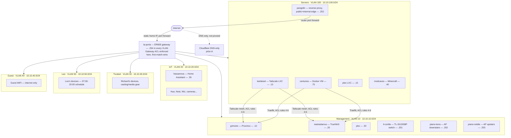

# Network Reference

This is a compact, agent-facing summary of the live network state. For history, incident write-ups and step-by-step verification, see the Homie project docs `network.md` and `tailscale-setup.md`. This note is the fast-reference version and is kept current.

Omada / NetBox site: **la-rocca** (was `SQRD-Home`). Drawn as a live map in [[Pianta della Rete]].

## Diagram

## VLANs

| VLAN | ID | Subnet | Purpose | Routed via Tailscale? |
|---|---|---|---|---|
| Management | 10 | `10.10.10.0/24` | Proxmox, TrueNAS, PBS, switch, APs | Yes |
| Servers | 100 | `10.10.100.0/24` | LXC/VM/Docker homelab | Yes |
| IoT | 20 | `10.10.20.0/24` | Home Assistant devices, smart home | No |
| Trusted | 30 | `10.10.30.0/24` | Richard's personal + casting/media devices | No |
| Leo | 50 | `10.10.50.0/24` | Leo's devices, 07:00–20:00 SSID schedule | No |
| Guest | 40 | `10.10.40.0/24` | Guest WiFi, internet only | No |

Addressing convention per VLAN:

- `.1`–`.99`: static infrastructure
- `.100`–`.200`: DHCP pool
- `.201`–`.253`: Omada infrastructure devices
- `.254`: gateway

## Hosts

| Host | IP | VLAN | Role |
|---|---|---|---|
| la-porta | `.254` in every VLAN | all | TP-Link ER605 gateway, gateway ACL (was `fw`) |
| grimoire | `10.10.10.10` | Management | Proxmox, standalone since 2026-09-26 (was `prox`, 1-node cluster dissolved) |
| nastradamus | `10.10.10.20` | Management | TrueNAS Scale (legacy `10.10.100.12` still present) |
| pbs | `10.10.10.30` | Management | Proxmox Backup Server (TrueNAS VM) |
| il-cortile | `10.10.10.201` | Management | TL-SG2008P switch, PoE for both APs (was `switch`) |
| piano-terra | `10.10.10.202` | Management | EAP245, downstairs (was `beneden`) |
| piano-nobile | `10.10.10.203` | Management | EAP225, upstairs (was `boven`) |
| centuries | `10.10.100.75` | Servers | Main Docker VM, runs Traefik |
| pangolin | `10.10.100.252` | Servers | Reverse proxy, internal AND public edge (router port-forward, no VPS/tunnel) |
| adguard | `10.10.100.1` | Servers | AdGuard Home 1 (primary DNS) |
| teelskeel | `10.10.100.13` | Servers | Tailscale subnet router, native `tailscaled` on Ubuntu LXC |
| plex | `10.10.100.15` | Servers | Plex, GPU passthrough |
| modcaves | `10.10.100.40` | Servers | Minecraft (Docker in LXC) |
| hassanova | `10.10.100.55` | IoT-adjacent* | Home Assistant, excluded from Ansible (`no_ansible`) |

\* hassanova's own IP is `.100.55`. The devices it manages live on IoT VLAN 20.

`no_ansible` is intentional on hassanova, grimoire and nastradamus. The playbooks are for Linux servers only.

## Naming

- **Themes:**
  - Hosts and storage follow Nostradamus: grimoire, nastradamus, centuries, almanac, …
  - The site and network gear follow the Da Vinci / Italian theme of the network map. The site is the fortress, the gear is its palazzo:
    - **la-rocca**: the site. The fortress the whole map draws, after Imola's Rocca Sforzesca.
    - **la-porta**: the gate every road between VLANs passes through.
    - **il-cortile**: the courtyard every room and stair opens onto (the switch).
    - **piano-terra**: the ground floor.
    - **piano-nobile**: the grand first floor.
- **Rules:**
  - Names are lowercase, hyphen-separated and hostname-safe.
  - Rename in the source that owns the name, never only in NetBox. The owners are:
    - Omada: gateway, switch and APs. The Omada → NetBox sync overwrites device names hourly.
    - Proxmox: guests. The sync matches on name, so rename in NetBox first.
    - NetBox: everything else, including the NetBox site (a separate object from the Omada site).
  - Keep the old name in `mappa` `policy.aliases` until the map's Errata stop mentioning it.
  - Reference the Omada site by `siteId`, never by name. The n8n sync picks the primary site; mappa's `OMADA_SITE` accepts a siteId.

## DNS

| Record | Resolves to | Notes |
|---|---|---|
| `*.sqrd.link` | `10.10.100.252` (Pangolin) | Wildcard default |
| `grimoire.sqrd.link` | `10.10.100.75` (centuries) | AdGuard rewrite, bypasses Pangolin on purpose |
| `nastradamus.sqrd.link` | `10.10.100.75` (centuries) | Same as above |
| `omada.sqrd.link` | `10.10.100.12:30077` | Controller |
| `*.prtsr.nl` | Cloudflare DNS-only, static home IP | Public, not proxied (raw TCP works, e.g. Minecraft) |

AdGuard runs as a primary at `10.10.100.1` and a secondary at `10.10.100.2`, synced via `adguardhome-sync`. A per-client override for `Leo` (CIDR `10.10.50.0/24`) enforces Parental Control, Safe Search and Safe Browsing.

## Gateway ACL: key facts (full 14-rule table in project doc `network.md`)

- Rules are first-match-wins and are enforced on la-porta for ALL inter-VLAN traffic, including traffic forwarded by Tailscale.
- **Rule 13 (deny):** `Servers, IoT, Trusted, Leo, Guest → Management` is blocked, except:
- **Rules 4-6 (permit):** `centuries` AND `teelskeel` → grimoire (SSH:22, web:8006) and nastradamus (SSH:22, web:4443) only.
- **Rule 14 (deny):** `IoT, Trusted, Leo, Guest → Servers` (direct IP) is blocked. The only path from client VLANs into Servers is via Pangolin (rules 2-3).
- **Rules 9-11 (permit):** Leo → plex, minecraft and Home Assistant only.
- **Rules 7-8 and 12 (permit):** Home Assistant ↔ IoT VLAN, and Trusted → Home Assistant.
- **Tool gap:** there is no ACL-read API. The table is maintained from UI screenshots and curl testing.

## Tailscale

- Host: `teelskeel` (`10.10.100.13`), running native `tailscaled`, not Docker.
- Advertised routes: `10.10.100.0/24` (Servers) and `10.10.10.0/24` (Management). It is also an exit node.
- IoT, Trusted, Leo and Guest are deliberately NOT routed.
- Gotcha: `grimoire.sqrd.link` / `nastradamus.sqrd.link` resolve to centuries. To test the Management route, use the raw IPs (`10.10.10.10:8006`, `10.10.10.20:4443`).

## Status

- **VLAN segmentation and Tailscale routing:** complete (2026-09-25).
- **grimoire rename and cluster dissolution:** done (2026-09-26). See [[Proxmox Rename - prox naar grimoire]].
- **Gateway and AP renames:** done in Omada (2026-09-26).
- **Switch rename (il-cortile) and site rename (la-rocca):** decided 2026-09-26. They take effect after the rename in Omada (and the NetBox site by hand).
